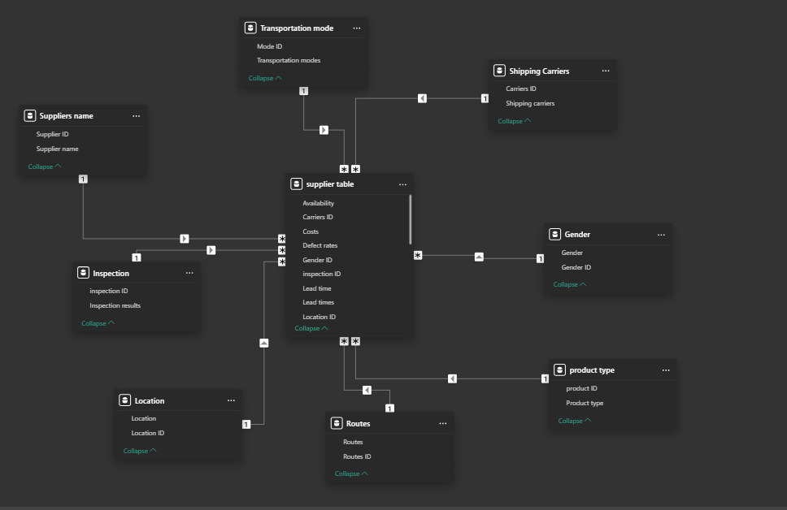
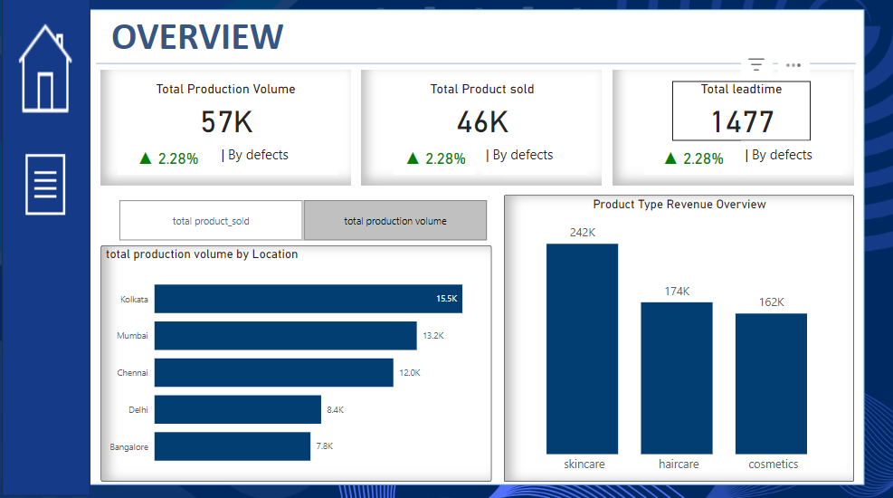
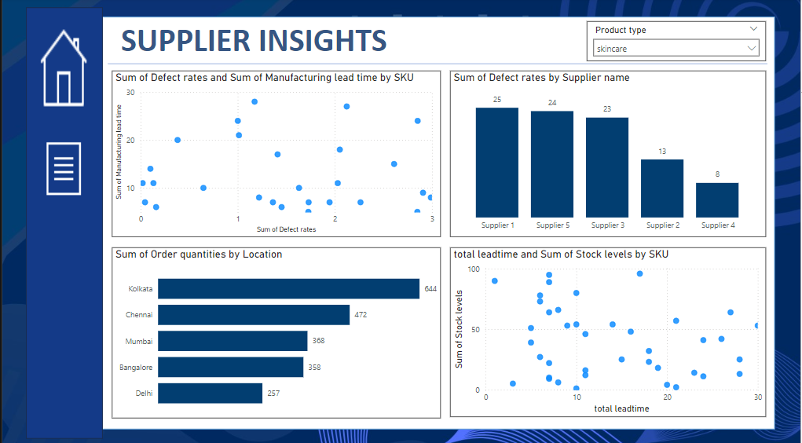

# Supply-chain-management project 

## Introduction 
Supply chain management (SCM) is the coordination of a business’ entire production flow, from sourcing raw materials to delivering a finished item.
The global supply chain is a complex network of suppliers, manufacturers, distributors, retailers, wholesalers and customers. SCM also involves the coordination of external partners and both internal resources and operations management. According to the Council of Supply Chain Management Professionals (CSCMP), “in essence, supply chain management integrates supply and demand management within and across companies.” 
This project focuses on analyzing production and stock data within the supply chain management framework. The primary objective is to identify trends, evaluate performance, and provide actionable insights to optimize production efficiency, improve stock management, and enhance quality control processes.
## Problem Statement 
Inefficiencies in production processes, unbalanced stock levels, and inconsistent inspection outcomes are affecting the overall performance of the supply chain. These issues lead to delays, increased costs, and missed revenue opportunities, making it crucial to identify and address the underlying problems effectively.
## Objectives
- Improve production efficiency by identifying regional and product-specific trends.
- Enhance stock management through better inspection outcomes and inventory practices.
- Maximize revenue by aligning production and inventory with demand trends.
- Provide actionable recommendations to streamline supply chain operations.

## Data Description 
The datasets used was gotten from Kaggle and the datasets consists of 100 rows and 24 columns. The table was later divided into dimension table making it 9 tables. The dataset has no duplicate values or missing values. 

### Data wrangling and Processing 
It is essential to verify that the data is clean, consistent, and ready for further exploration and visualization. These are the steps for data validation and data wrangling:

- Check necessary data types against their detail information
- Identify missing values, duplicate values, and inconsistent formats
- Handle missing values, duplicate values, and inconsistent formats
After cleaning and ensuring data is cleaned, data modeling was done after dimension tables were created from the initial supply chain table.

 

## Metrics 
- The total production from the supply chain management was 57,000 with a 2.28% increase driven by reduced defects.
- the total product sold was 46,000 units with a 2.28% increase driven by reduced defects.
- the total lead time was 1477 with a 2.28% increase driven by reduced defects.
## Analysis

### Overview Dashboard

## Metrics Displayed:
Total production volume (57K), total product sold (46K), and total lead time (1,477).

## Key Insights:
- Kolkata has the highest production volume (15.5K), followed by Mumbai and Chennai.
- Skincare generates the most revenue (242K), followed by haircare and cosmetics. 

## Stock Insights Dashboard

### Metrics Displayed: Fail inspection (36%), pending inspection (41%), and pass inspection (23%).
Key Insights:
- Consistently high stock levels for key SKUs.
- Haircare has the highest stock level (1,644 units), followed by skincare and cosmetics.

## Route and Demographics Dashboard
### Metrics Displayed: 
Order quantities, lead time by route, revenue by gender, and profits by location.

Key Insights:
- Road, rail, and air have similar order quantities (~1,340), while sea lags behind.
- Unknown gender contributes the most revenue (173K), with Chennai leading profits by location (11.4K).

## Supplier Insights Dashboard

## Metrics Displayed: 
Defect rates, manufacturing lead times, and stock levels by SKU.

Key Insights:
- Supplier 1 has the highest defect rate (25), followed closely by Supplier 5.
- Kolkata has the highest order quantities (644), while Delhi has the lowest (257).
  
## Recommendations
- Focus on optimizing sea routes to improve order fulfillment efficiency.
- Investigate the high revenue contribution from the "unknown" gender category for better marketing segmentation.
- Work with suppliers to reduce defect rates, prioritizing Supplier 1 and Supplier 5.
- Maintain consistent stock levels across all product types to avoid shortages.

## Conclusion
The dashboards provide actionable insights into key aspects of the supply chain, including production, stock management, route optimization, and supplier performance. By implementing the recommended actions, organizations can enhance efficiency, reduce costs, and improve customer satisfaction.

